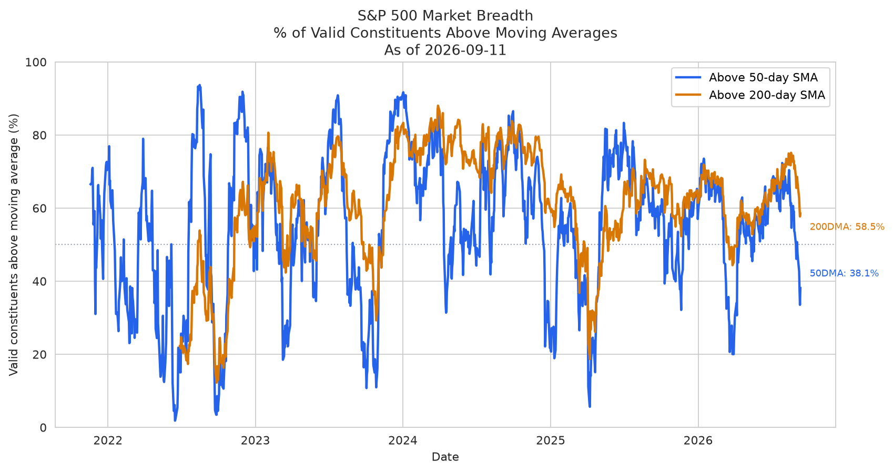
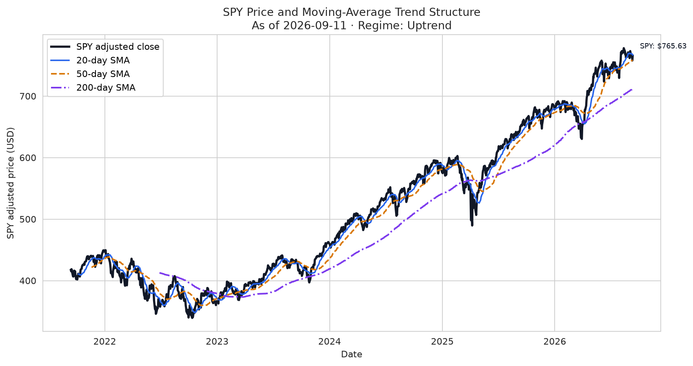
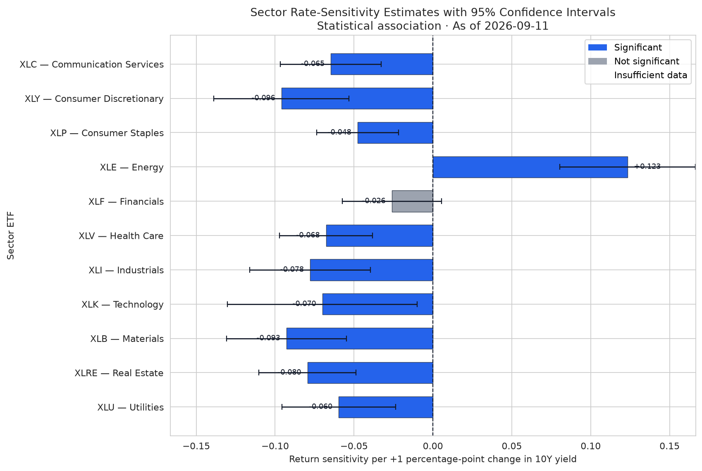

# AI-Powered Market Analysis System

This project turns publicly available U.S. equity prices and 10-year Treasury
yields into a reproducible market-structure report. It measures whether S&P 500
performance has broad participation, classifies SPY trend conditions, and
estimates how sector ETFs have been associated with yield changes. A
deterministic Pandas/NumPy pipeline writes validated quantitative artifacts
first; an optional OpenAI layer interprets those artifacts without recalculating
them.

This report is for research and educational purposes only and does not
constitute investment advice.

## Features

- S&P 500 market breadth from current constituents with complete moving-average windows
- SPY trend regime from accepted SMA20 / SMA50 / SMA200 structure
- Sector Treasury-yield sensitivity with one-factor OLS and HC3 inference
- Structured, evidence-grounded AI interpretation of validated JSON only
- Deterministic tests, cached reruns, and graceful degradation when OpenAI is unavailable

## Architecture

U.S. equity prices + 10Y Treasury yields  
→ Pandas/NumPy data pipeline  
→ breadth and trend signals  
→ sector rate-sensitivity regressions  
→ structured quantitative output  
→ OpenAI API interpretation  
→ structured market summary  
→ Markdown report

## Implemented scope

- Current S&P 500 universe acquisition and caching
- Adjusted equity, SPY, and 11-sector ETF prices
- FRED DGS10 yields in percentage points
- Market-breadth and SPY-trend calculations
- One-factor sector yield-sensitivity regressions with HC3 errors
- Validated `quant_summary.json`
- Three deterministic PNG charts
- Optional grounded OpenAI interpretation → `market_summary.json`
- Deterministic `market_report.md`
- CLI orchestration with SUCCESS / PARTIAL / FAILURE exit codes

## Web Dashboard

The v1.2 product shell is a Next.js / TypeScript app in `web/`. It uses
Recharts to render Market Breadth, SPY Trend, and Sector Rate Sensitivity
charts from a static validated snapshot in `web/public/data/`. Chart range
controls (1Y / 3Y / 5Y) only filter already-exported dates.

The browser does not hold an OpenAI key and does not call OpenAI. Public
visitors can inspect the latest snapshot. `POST /api/run-analysis` is an
owner-authorized server route that may later dispatch GitHub Actions. It
does not run Python in Next.js. Live dispatch is not configured by default.

```bash
python -m src.main --run-id web-live-snapshot --export-web-snapshot
cd web
npm install
npm run dev
```

See `docs/v1.2_run_architecture.md`. Vercel is not live.

## Example Outputs

The charts below are documentation samples of the three run artifacts. Live
runs write the same filenames under `outputs/<run_id>/` and are not committed.







- `breadth_timeseries.png`
- `spy_trend.png`
- `sector_rate_beta.png`

## Out of scope

The project does not include RAG, vector databases, embeddings, LangChain,
LangGraph, autonomous agents, FastAPI / Flask, AWS / cloud
deployment, Docker / Kubernetes, broker integration, automated trading,
portfolio optimization, backtesting trading strategies, real-time /
high-frequency market data, predictive return models, or individual stock
recommendations.

## Repository structure

- `config/default.yaml`: typed defaults and canonical yield unit
- `src/main.py`: CLI orchestration
- `src/pipeline.py`: end-to-end stage runner
- `src/config.py`: CLI > environment > YAML configuration
- `src/data_loader.py`: providers, cache, acquisition metadata
- `src/preprocessing.py`: canonical validation and transforms
- `src/breadth.py`: participation and advance/decline formulas
- `src/trend.py`: SPY SMAs, distances, and regimes
- `src/regression.py`: isolated one-factor OLS with HC3 inference
- `src/quant_pipeline.py`: quantitative assembly and `quant_summary.json`
- `src/visualization.py`: three headless PNG charts
- `src/interpretation.py`: optional OpenAI interpretation
- `src/reporting.py`: deterministic Markdown assembly
- `src/fixture_data.py`: developer/demo synthetic data only
- `tests/`: deterministic tests; no live providers by default
- `docs/acceptance.md`: fixture and real-data acceptance evidence
- `docs/web_data_contract.md`: v1.1 static snapshot contract
- `docs/images/`: documentation-only sample charts
- `src/web_export.py`: optional static snapshot for the web dashboard
- `web/`: Next.js dashboard (static snapshot, no API)
- `web/public/data/`: presentation snapshot written only with `--export-web-snapshot`
- `data/raw/`: ignored CSV caches
- `outputs/`: ignored run artifacts

## Data sources

- Current S&P 500 membership: the public Wikipedia constituent table. Symbols
  are normalized for Yahoo Finance (for example, `BRK.B` becomes `BRK-B`).
- Equity, SPY, and the 11 sector ETF prices: `yfinance`.
- Ten-year Treasury yield: FRED series `DGS10` through
  `pandas-datareader`.

Vendor-specific columns are converted into these internal contracts:

- Equities and sectors: `date`, `ticker`, `adjusted_close`
- SPY: `date`, `adjusted_close`
- DGS10: `date`, `yield_percent`
- Price returns add `equity_return`
- Yield changes add `yield_change`

Price downloads explicitly request `auto_adjust=False` and use `Adj Close`.
`Close` is accepted only when a provider explicitly marks it as already
adjusted; the selected treatment is recorded in metadata.

`yield_percent` remains in percentage points: `4.25` means 4.25 percent, not
`0.0425`. Therefore, a move from `4.30` to `4.35` produces a `yield_change` of
`0.05` percentage points.

Daily observations are used. Dates are timezone-naive midnight dates sorted
ascending. No missing prices or returns are fabricated. Legitimate missing
DGS10 levels are not forward-filled.

## Survivorship-bias limitation

Historical breadth analysis using the CURRENT S&P 500 constituent universe is
subject to survivorship bias. The system does not use point-in-time membership.

## Market breadth

`src/breadth.py` consumes canonical multi-ticker adjusted prices and calculates:

- `pct_above_50dma`: stocks strictly above their complete 50-observation SMA,
  divided by stocks with a valid SMA50, multiplied by 100.
- `pct_above_200dma`: stocks strictly above their complete 200-observation SMA,
  divided by stocks with a valid SMA200, multiplied by 100.
- `advancers`: valid simple returns greater than zero.
- `decliners`: valid simple returns less than zero.
- `advance_decline_ratio`: advancers divided by decliners; missing when there
  are zero decliners.
- `net_advances`: advancers minus decliners.
- `breadth_momentum_20d`: current `pct_above_50dma` minus the value 20 ordered
  breadth observations earlier, in percentage points.

Only stocks with a complete moving-average window enter the corresponding
denominator. A price exactly equal to its SMA is not above it.

## SPY market trend

`src/trend.py` computes complete-window arithmetic `sma_20`, `sma_50`, and
`sma_200`. Distance uses `adjusted_close / SMA - 1` and is not multiplied by
100.

Regimes use strict inequalities in this priority:

- `strong_uptrend`: `SPY > SMA20 > SMA50 > SMA200`
- `strong_downtrend`: `SPY < SMA20 < SMA50 < SMA200`
- `uptrend`: `SPY > SMA50` and `SMA50 > SMA200`, unless already strong
- `downtrend`: `SPY < SMA50` and `SMA50 < SMA200`, unless already strong
- `transition`: inconsistent directions, plus full-data equality boundaries
- `insufficient_data`: price or any required SMA is missing

`SPY == SMA50` or `SMA50 == SMA200` produces `transition` when all values are
available.

## Sector rate-sensitivity regression

For each configured sector ETF, `src/regression.py` estimates:

`sector_return = alpha + beta_yield * yield_change + error`

Each one-factor OLS model uses common valid dates and the most recent 252
aligned observations. Between 200 and 251 observations are accepted; fewer
than 200 produce `insufficient_data`.

Inference uses HC3 heteroskedasticity-robust standard errors. Significance
uses `p < 0.05`. Because 10 basis points equals 0.10 percentage points,
`effect_10bp = beta_yield * 0.10`.

Allowed labels: `positive_significant`, `negative_significant`,
`positive_not_significant`, `negative_not_significant`, `insufficient_data`.

These results describe association and exposure, not causation.

## QuantSummary

`outputs/<run_id>/quant_summary.json` (`schema_version` `1.0.0`) contains
`run_metadata`, `data_quality`, `breadth`, `trend`, `sector_regressions`,
`limitations`, and `status`. The as-of date is the latest date actually shared
by breadth and trend outputs.

Example:

```json
{
  "schema_version": "1.0.0",
  "status": "success",
  "run_metadata": {
    "run_id": "fixture-acceptance",
    "as_of_date": "2024-02-29",
    "yield_unit": "percentage_points"
  },
  "breadth": {"pct_above_50dma": 60.0, "pct_above_200dma": 40.0},
  "trend": {"trend_regime": "uptrend"},
  "sector_regressions": [{"ticker": "XLK", "sensitivity_label": "negative_significant"}]
}
```

Unavailable values are JSON `null`. `NaN` and `Infinity` are rejected.

## OpenAI interpretation contract

`src/interpretation.py` consumes only a validated `QuantSummary`. Successful
new `market_summary.json` files include:

- `executive_summary`
- `market_participation`
- `trend_conditions`
- `sector_rate_risk`
- `risks_and_limitations`
- `evidence` (and `evidence_used`)
- `disclaimer`

OpenAI is optional. Missing keys, `--skip-openai`, timeouts, and invalid
structured output produce `status: unavailable` without discarding quantitative
artifacts. Tests mock OpenAI and do not make live API calls.

Example unavailable artifact:

```json
{
  "run_id": "fixture-acceptance",
  "as_of_date": "2024-02-29",
  "status": "unavailable",
  "reason": "skipped",
  "executive_summary": null
}
```

## Visualizations

Under `outputs/<run_id>/`:

- `breadth_timeseries.png`
- `spy_trend.png`
- `sector_rate_beta.png`

Charts consume precomputed series and validated sector records. They do not
recalculate indicators. Unexpected chart failures keep `quant_summary.json`
and mark the run PARTIAL; the report notes missing images.

## Report structure

`market_report.md` headings:

1. `# AI-Powered Market Analysis System`
2. `## Executive Summary`
3. `## Market Participation`
4. `## Trend Conditions`
5. `## Sector Rate Sensitivity`
6. `## Data Quality`
7. `## Methodology and Limitations`
8. `## Disclaimer`

Report generation does not call OpenAI.

## Installation

Python 3.11 or newer is required.

```bash
python3.11 -m venv .venv
source .venv/bin/activate
python -m pip install -e ".[dev]"
cp .env.example .env
```

## Environment variables

Configuration precedence is CLI overrides, then environment variables, then
`config/default.yaml`.

- `OPENAI_API_KEY` (optional)
- `OPENAI_MODEL` (optional)
- `MARKET_ANALYSIS_REGRESSION_WINDOW`
- `MARKET_ANALYSIS_MIN_REGRESSION_OBS`
- `MARKET_ANALYSIS_BENCHMARK_TICKER`
- `MARKET_ANALYSIS_RAW_DATA_DIRECTORY`
- `MARKET_ANALYSIS_TREASURY_SERIES`
- `MARKET_ANALYSIS_OUTPUT_DIRECTORY`
- `MARKET_ANALYSIS_LOG_LEVEL`

`.env.example` contains names only. Real credentials belong in the ignored
`.env` file. Secrets are not logged.

## CLI usage

```bash
python -m src.main
python -m src.main --skip-openai
python -m src.main --start-date 2021-01-04 --end-date 2026-09-11
python -m src.main --force-refresh --output-dir outputs --run-id my-run
python -m src.main --fixture --skip-openai --run-id fixture-acceptance
python -m src.main --run-id web-live-snapshot --export-web-snapshot
```

Supported flags: `--config`, `--start-date`, `--end-date`, `--force-refresh`,
`--output-dir`, `--run-id`, `--skip-openai`, `--export-web-snapshot`,
`--web-snapshot-dir`, `--fixture`, `--log-level`.

`--export-web-snapshot` is the only path that writes `web/public/data/`. It
runs after the accepted v1.0 artifacts exist and serializes already-computed
breadth/trend frames. A web-export failure leaves those v1.0 artifacts in
place and records a warning (PARTIAL). Use `--web-snapshot-dir` to write
somewhere other than the dashboard folder.

Default live dates are approximately five complete years through the most
recent completed weekday; the published as-of date remains data-derived.

`--fixture` is a developer/demo path using deterministic synthetic data. It
does not contact market-data providers. Unless a test injects a mock completer,
fixture mode skips OpenAI.

`--skip-openai` runs all deterministic stages, writes `market_summary.json`
with `status: unavailable` and `reason: skipped`, writes `market_report.md`,
and makes no OpenAI network calls. Exit status is PARTIAL.

## Cache behavior

Canonical files under ignored `data/raw/` are reused unless `--force-refresh`.
Each CSV has a `.metadata.json` sidecar. Fixture/demo runs write to
`data/raw/_fixture/` so they cannot overwrite production caches.

## Output directory

```
outputs/<run_id>/
├── quant_summary.json
├── breadth_timeseries.png
├── spy_trend.png
├── sector_rate_beta.png
├── market_summary.json
└── market_report.md
```

One `run_id` identifies every artifact from a single execution.

## Exit codes

- `0` SUCCESS: quantitative success, charts written, interpretation available, report written
- `1` FAILURE: critical data/quant failure, or report could not be written
- `2` PARTIAL: quantitative artifacts valid, but OpenAI skipped/failed, a chart failed, web snapshot export failed, or quant status is partial

Critical quantitative failure does not call OpenAI and does not write a
misleading `quant_summary.json` or report.

Unexpected visualization failure retains `quant_summary.json`, records a
warning, allows missing-image report notes, and returns PARTIAL.

Unexpected `market_report.md` write failure retains upstream JSON/PNG files
and returns FAILURE.

## Web dashboard commands

```bash
cd web
npm install
npm run dev
npm run typecheck
npm run lint
npm run build
npm run test:charts
```

The browser loads only files under `web/public/data/`. It does not call OpenAI
or any application API. Vercel should use Root Directory `web` and
`npm run build`, with no secrets.

## Testing

```bash
pytest
pytest --cov=src --cov-report=term-missing
ruff check .
black --check src tests
```

Core quantitative modules are expected to remain at or above 80% line
coverage. Deterministic tests do not contact Yahoo Finance, Wikipedia, FRED,
or OpenAI.

## Error handling

- Missing or invalid configuration → FAILURE
- Provider/cache/schema-critical data errors → FAILURE, no OpenAI
- Valid quant + skipped/failed OpenAI → PARTIAL, unavailable `market_summary.json`, report still generated
- Valid quant + successful OpenAI + report → SUCCESS

## Methodological limitations

- Current-universe survivorship bias
- Sector regressions are association, not causation
- One-factor daily models omit other market and macro factors
- Cache and provider gaps can reduce coverage
- OpenAI output is constrained to supplied quantitative evidence

## Investment disclaimer

This report is for research and educational purposes only and does not
constitute investment advice. It does not provide buy/sell calls, position
sizing, expected returns, or portfolio recommendations.

## Resume ↔ Implementation mapping

Resume statement:

> Built a Pandas/NumPy market-data pipeline integrating U.S. equity prices
> and 10-year Treasury yields to compute breadth and trend signals and run
> regressions measuring sector exposure to yield changes. Integrated the
> OpenAI API to interpret indicators and regression outputs and generate
> structured summaries of market participation, trend conditions, and
> sector-level interest-rate risk.

| Claim | Source module | Structured output | Evidence |
| --- | --- | --- | --- |
| Pandas/NumPy market-data pipeline | `data_loader.py`, `preprocessing.py`, `quant_pipeline.py` | canonical frames and `quant_summary.json` | `tests/test_data_loader.py`, `tests/test_preprocessing.py`, `tests/test_quant_pipeline.py`, `tests/test_integration.py` |
| U.S. equity prices | `data_loader.py` / `preprocessing.py` | `date`, `ticker`, `adjusted_close` | equity/SPY/sector fixtures and loader tests |
| 10-year Treasury yields | `data_loader.py` / `preprocessing.py` | `yield_percent`, `yield_change` | DGS10 tests |
| Breadth signals | `breadth.py` | `quant_summary.breadth`, `breadth_timeseries.png` | `tests/test_breadth.py`, visualization tests |
| Trend signals | `trend.py` | `quant_summary.trend`, `spy_trend.png` | `tests/test_trend.py` |
| Sector exposure regressions | `regression.py` | `quant_summary.sector_regressions`, `sector_rate_beta.png` | `tests/test_regression.py` |
| OpenAI API | `interpretation.py`, `llm_analyzer.py` | `market_summary.json` | mocked `tests/test_interpretation.py` |
| Market participation | interpretation + reporting | `market_summary.market_participation` | report + integration tests |
| Trend conditions | interpretation + reporting | `market_summary.trend_conditions` | report + integration tests |
| Sector-level interest-rate risk | interpretation + reporting | `market_summary.sector_rate_risk` | report + integration tests |
| Structured summaries | reporting | `market_summary.json`, `market_report.md` | `tests/test_reporting.py`, `tests/test_integration.py` |
