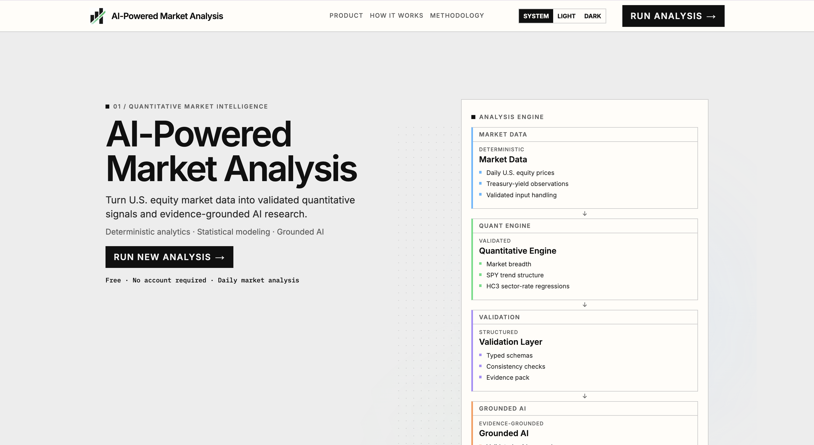
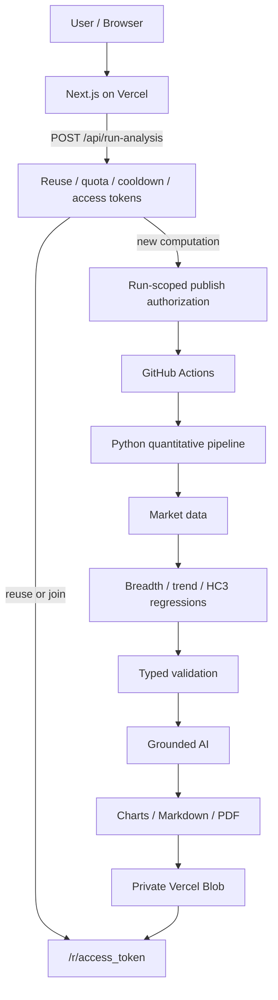

<p align="center">
  
</p>

<h1 align="center">AI-Powered Market Analysis</h1>

<p align="center">
  Quantitative market intelligence with evidence-grounded AI interpretation.
</p>

<p align="center">
  <a href="https://ai-powered-market-analysis.vercel.app"></a>&nbsp;&nbsp;<a href="https://github.com/yanchenliu-joe/ai-powered-market-analysis-system"></a>
</p>

<p align="center">
  <em>The quantitative engine computes the evidence. The AI interprets it.</em>
</p>

<p align="center">
  
</p>

A production web product that turns U.S. equity prices and 10-year Treasury
yields into validated market-structure signals, an interactive research report,
and a downloadable PDF. Deterministic Pandas / NumPy computation runs first.
An optional OpenAI layer interprets only that validated output. The model does
not calculate indicators, moving averages, or regressions.

This is not a notebook demo. The public site is live on Vercel. New
computation runs in GitHub Actions and publishes to private object storage.

---

## Overview

The system produces:

- validated quantitative market signals
- interactive charts and a research report
- evidence-grounded AI interpretation
- a downloadable PDF

Pipeline:

```
Market data
  → deterministic quantitative computation
  → typed validation
  → evidence pack
  → grounded AI interpretation
  → interactive report / PDF
```

AI is strictly downstream of quantitative validation. If interpretation is
unavailable, the quantitative artifacts remain valid.

---

## What the System Analyzes

### Market Breadth

Current S&P 500 constituents (complete moving-average windows only):

- share of names strictly above their 50DMA and 200DMA
- advancers / decliners and the advance-decline ratio
- 20-observation breadth momentum (`pct_above_50dma` change)

### SPY Trend Structure

Complete-window SMA20, SMA50, and SMA200, plus distance to each average.
Regimes use strict inequalities (`strong_uptrend`, `uptrend`, `transition`,
`downtrend`, `strong_downtrend`, or `insufficient_data`). No composite score
is computed.

### Sector Rate Sensitivity

Eleven sector ETFs versus daily changes in FRED `DGS10`. One-factor OLS:

`sector_return = alpha + beta_yield * yield_change + error`

HC3 robust inference, `p < 0.05` significance labels, and a 10bp effect
(`beta_yield * 0.10`). Results describe association, not causation.

### Grounded AI Interpretation

Consumes a validated `QuantSummary` only. Structured output must cite
evidence-pack paths. The model is instructed not to recompute metrics or
invent values. Missing keys, timeouts, or invalid output yield
`status: unavailable` without discarding the quantitative run.

---

## System Architecture



- Next.js does not run quantitative calculation.
- GitHub Actions executes the Python pipeline.
- Validated artifacts are written to **private** Vercel Blob.
- Reports resolve only through an opaque access token at `/r/[token]`.
- Same-day accepted results can be reused so most visitors do not start a
  new pipeline.

`/report` is a labeled sample snapshot from `web/public/data/`. Live runs
never write into that directory.

---

## Grounded AI Design

The LLM is not the source of quantitative truth.

```
Raw market data
  → deterministic metrics
  → QuantSummary
  → validation / evidence contract
  → structured AI interpretation
```

`src/interpretation.py` sends a validated evidence pack. Prompts forbid
recomputation, invented prices, and trading advice. Evidence items must use
exact `source_section` and `metric` paths from the pack.

If `OPENAI_API_KEY` is missing, `--skip-openai` is set, or the model fails
validation, the run still keeps `quant_summary.json`, series, and charts. The
report surfaces AI as unavailable. Tests mock the OpenAI client; they do not
call the live API by default.

---

## Production Run Architecture

Public `POST /api/run-analysis` (no login, no owner password):

1. Reuse today's accepted bundle if it is still the latest completed NYSE
   session, and mint a new visitor token.
2. Otherwise join an in-flight run.
3. Otherwise apply a hashed-client cooldown and a daily new-run quota.
4. Otherwise queue a new `run_id`, mint an access alias, and dispatch Actions.

The Vercel server uses Blob OIDC (`BLOB_STORE_ID`) for private store I/O.
For a new run it issues short-lived, **exact-pathname** PUT URLs via
`issueSignedToken` + `presignUrl` for `analysis/<run_id>/` artifacts only.
Actions receives that JSON capability — not a Blob master token, not Vercel
account credentials, and not write access to `control/` or `access/`.

After upload, the worker calls `POST /api/internal/finalize-run` with a
one-time nonce. Vercel writes reusable-daily state and releases the active
lock. Publish authorization expires (45 minutes). The workflow masks
`ACCESS_TOKEN` and `PUBLISH_AUTHORIZATION` before later steps.

The browser never receives OpenAI keys, Blob tokens, OIDC material, or
publish URLs.

---

## Security Model

| Control | Behavior |
| --- | --- |
| Compute isolation | Python runs in GitHub Actions, not in the browser or Next.js |
| Blob auth | Server OIDC; worker gets per-file signed PUTs for one `run_id` |
| Control plane | Vercel writes `control/*`; the worker cannot |
| Report access | `/r/<access_token>` and PDF/status APIs resolve aliases server-side |
| No catalog | No bucket listing or public “latest report” index |
| Abuse | Cooldown, UTC daily quota, one active computation, daily reuse |
| Secrets | OpenAI key is an Actions secret; no `NEXT_PUBLIC_` infrastructure secrets |

Optional `POST /api/admin/refresh-analysis` can force a new pipeline. It is
not shown in the public UI.

Details: [docs/live_run_delivery.md](docs/live_run_delivery.md).

---

## Interactive Report

Token-scoped live reports and the labeled `/report` sample share the same
research layout:

- Overall Market State (accepted trend regime and breadth headlines)
- Grounded AI Market Brief (or an honest unavailable state)
- Market breadth, SPY trend, and sector-rate charts (1Y / 3Y / 5Y slice
  already-exported dates; they do not recompute)
- Data quality
- Technical appendix
- Downloadable PDF

<p align="center">
  
  
  
</p>

---

## Tech Stack

**Quantitative / data:** Python 3.11, Pandas, NumPy, statsmodels, yfinance,
FRED via pandas-datareader, Matplotlib / Seaborn, ReportLab

**AI:** OpenAI API, Pydantic structured output and schema validation

**Web:** Next.js, React, TypeScript, Recharts

**Infrastructure:** Vercel, private Vercel Blob, GitHub Actions, OIDC and
run-scoped signed upload capabilities

**Engineering:** pytest, ruff, black, ESLint, TypeScript `tsc`, Next.js
production build

Not used: LangChain, LangGraph, RAG, vector databases, FastAPI, Docker, AWS.

---

## Testing & Reliability

Python and frontend suites cover:

- deterministic breadth, trend, and HC3 regression contracts
- typed `QuantSummary` / interpretation schemas
- AI graceful degradation and evidence-path validation
- mocked provider and OpenAI calls
- public reuse, freshness, quota, and cooldown policy
- run-scoped publish authorization, expiry, and finalize
- chart/data-contract tests (no fabricated zeros)
- `typecheck`, ESLint, and production `next build`

```bash
pip install -e ".[dev]"
pytest
ruff check .
black --check src tests

cd web
npm install
npm run test:charts
npm run typecheck
npm run lint
npm run build
```

---

## Repository Structure

```
.
├── src/            # Python quantitative + AI pipeline
├── tests/          # Python tests
├── web/            # Next.js product
├── docs/           # architecture and acceptance documentation
├── config/         # quantitative configuration
├── data/           # ignored runtime/cache data
├── outputs/        # ignored run artifacts
└── .github/        # GitHub Actions compute workflow
```

Important entry points: `src/main.py`, `src/pipeline.py`,
`src/quant_pipeline.py`, `src/interpretation.py`, `src/live_run_publish.py`,
`web/src/lib/run-trigger.ts`, `.github/workflows/run-market-analysis.yml`.

---

## Running Locally

Local analysis is separate from production live-run infrastructure (Vercel
OIDC, Blob, and Actions).

**Python (3.11)**

```bash
python3.11 -m venv .venv
source .venv/bin/activate
pip install -e ".[dev]"
cp .env.example .env
python -m src.main --run-id local-demo
```

`OPENAI_API_KEY` is optional. Without it, interpretation is unavailable and
quantitative outputs still write under `outputs/<run_id>/`.

**Web UI**

```bash
cd web
npm install
npm run dev
```

The local app serves the product shell and the labeled sample at `/report`.
Production Start Analysis requires the deployed Vercel + Actions path.

---

## Methodology

Compressed facts; full contracts live in `docs/`.

- **Survivorship:** breadth uses the *current* S&P 500 list, not
  point-in-time membership.
- **Breadth:** complete SMA windows only; price equal to its SMA is not
  “above.”
- **Trend:** priority-ordered strict SMA inequalities; equality falls to
  `transition` when all values exist.
- **Sectors:** last 252 aligned observations when possible; 200–251
  accepted; fewer than 200 is `insufficient_data`.
- **Yields:** `DGS10` stays in percentage points (`4.25` is 4.25%, not
  0.0425). A move from 4.30 to 4.35 is `0.05`.
- **Association ≠ causation.** No forecasts or trade recommendations.

Deeper reading:

- [docs/acceptance.md](docs/acceptance.md)
- [docs/web_data_contract.md](docs/web_data_contract.md)
- [docs/live_run_delivery.md](docs/live_run_delivery.md)
- [docs/v1.2_run_architecture.md](docs/v1.2_run_architecture.md)

---

## Disclaimer

Research and educational use only. Not investment advice. Statistical
associations are not forecasts or trading recommendations.
